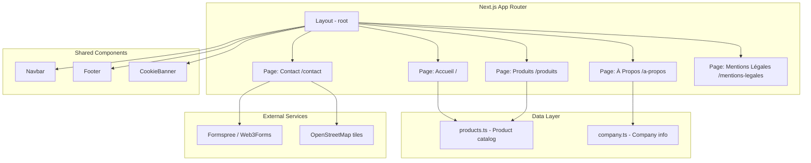

# Design Document — Mango Import Website

## Overview

This document describes the technical design for a professional website showcasing a Senegalese mango import business operated by Cheikh Ahmadou Bamba Sall, based in Chevilly-Larue, France. The site serves as a commercial showcase targeting both B2B (wholesalers, restaurants, distributors) and B2C customers.

The website is a static multi-page site built with **Next.js 14 (App Router)** and **TypeScript**, styled with **Tailwind CSS**. It will be statically exported (`next export`) for deployment on any static hosting platform (Vercel, Netlify, or similar). No backend server or database is required — the contact form will submit via a third-party service (e.g., Formspree or Web3Forms), and all product data is stored as static content.

### Key Technical Decisions

| Decision | Choice | Rationale |
|---|---|---|
| Framework | Next.js 14 (App Router) | Static site generation, built-in image optimization, SEO-friendly routing, excellent Lighthouse scores |
| Language | TypeScript | Type safety, better developer experience, catches errors at build time |
| Styling | Tailwind CSS | Utility-first approach, responsive design built-in, small bundle size with purging |
| Content | Static JSON/TS files | No CMS needed for a small product catalog; easy to maintain |
| Contact form | Client-side with external service | No backend needed; Formspree/Web3Forms handles email delivery |
| Map | Leaflet with OpenStreetMap | Free, no API key required, RGPD-friendly (no Google tracking) |
| Cookie consent | Custom lightweight component | CNIL-compliant, no heavy third-party library needed |
| Deployment | Static export | Fast, cheap, secure — no server to maintain |

## Architecture

The application follows a standard Next.js App Router structure with static site generation.



### Project Structure

```
src/
├── app/
│   ├── layout.tsx              # Root layout (Navbar, Footer, CookieBanner)
│   ├── page.tsx                # Homepage (/)
│   ├── produits/
│   │   └── page.tsx            # Products page (/produits)
│   ├── a-propos/
│   │   └── page.tsx            # About page (/a-propos)
│   ├── contact/
│   │   └── page.tsx            # Contact page (/contact)
│   ├── mentions-legales/
│   │   └── page.tsx            # Legal mentions (/mentions-legales)
│   ├── sitemap.ts              # Dynamic sitemap generation
│   └── robots.ts               # Robots.txt generation
├── components/
│   ├── layout/
│   │   ├── Navbar.tsx          # Navigation bar with hamburger menu
│   │   └── Footer.tsx          # Site footer
│   ├── home/
│   │   ├── HeroSection.tsx     # Hero banner with CTA
│   │   ├── SellingPoints.tsx   # Three key selling points
│   │   ├── ProductPreview.tsx  # Featured mango varieties
│   │   ├── Testimonials.tsx    # Testimonials / key figures
│   │   └── CtaSection.tsx      # Bottom call-to-action
│   ├── products/
│   │   └── ProductCard.tsx     # Individual product card
│   ├── contact/
│   │   ├── ContactForm.tsx     # Contact form with validation
│   │   └── LocationMap.tsx     # Leaflet/OpenStreetMap embed
│   ├── cookies/
│   │   └── CookieBanner.tsx    # RGPD cookie consent banner
│   └── ui/
│       ├── Button.tsx          # Reusable button component
│       └── SectionHeading.tsx  # Reusable section heading
├── data/
│   ├── products.ts             # Mango variety catalog
│   └── company.ts              # Company information constants
├── lib/
│   ├── validation.ts           # Form validation utilities
│   └── cookies.ts              # Cookie consent management
├── types/
│   └── index.ts                # TypeScript type definitions
└── styles/
    └── globals.css             # Tailwind imports + custom CSS variables
```

## Components and Interfaces

### Navbar Component

```typescript
// components/layout/Navbar.tsx
interface NavbarProps {
  // No props needed — uses static navigation links
}

// Behavior:
// - Displays logo + company name on the left
// - Navigation links on the right: Accueil, Produits, À Propos, Contact
// - Collapses to hamburger menu below 768px (md breakpoint)
// - Hamburger button has aria-expanded and aria-controls attributes
// - Mobile menu is a slide-down panel with focus trap
// - Active page link is visually highlighted
```

### Footer Component

```typescript
// components/layout/Footer.tsx
interface FooterProps {
  // No props needed — uses static company data
}

// Displays:
// - Company address: 14 voie des meuniers, 94550 Chevilly-Larue
// - SIREN: 947 529 046
// - Link to /mentions-legales
// - Link to /contact
// - Copyright notice
```

### CookieBanner Component

```typescript
// components/cookies/CookieBanner.tsx
interface CookieBannerProps {
  // No props needed — manages its own state via cookies.ts
}

// Behavior:
// - Checks localStorage for existing consent on mount
// - If no consent stored: displays banner with "Accepter" and "Refuser" buttons
// - "Accepter": stores consent, hides banner, enables non-essential cookies
// - "Refuser": stores refusal, hides banner, blocks non-essential cookies
// - Consent stored for 13 months (CNIL requirement)
// - No non-essential cookies loaded until explicit consent
```

### ProductCard Component

```typescript
// components/products/ProductCard.tsx
interface ProductCardProps {
  product: Product;
}

// Displays:
// - Product image (WebP format, with descriptive alt text in French)
// - Variety name
// - Taste and texture description
// - Availability season
// - Caliber information
// Responsive: single column on mobile, 2-3 column grid on desktop
```

### ContactForm Component

```typescript
// components/contact/ContactForm.tsx
interface ContactFormProps {
  // No props — manages its own state
}

interface ContactFormData {
  fullName: string;       // Required
  email: string;          // Required, validated format
  phone: string;          // Optional
  requestType: 'particulier' | 'professionnel'; // Required
  message: string;        // Required
}

// Behavior:
// - Client-side validation before submission
// - Shows field-specific error messages without clearing entered data
// - Email format validation with specific error message under the field
// - On successful submit: sends to external service, shows confirmation message
// - On failed submit: shows error message, preserves form data
```

### ContactForm Validation Module

```typescript
// lib/validation.ts

interface ValidationResult {
  isValid: boolean;
  errors: Record<string, string>;
}

function validateContactForm(data: ContactFormData): ValidationResult;
function validateEmail(email: string): boolean;
function validateRequired(value: string, fieldName: string): string | null;
```

### Cookie Consent Module

```typescript
// lib/cookies.ts

interface CookieConsent {
  accepted: boolean;
  timestamp: number;       // Date.now() when consent was given
  expiresAt: number;       // timestamp + 13 months
}

function getConsent(): CookieConsent | null;
function setConsent(accepted: boolean): void;
function isConsentValid(consent: CookieConsent): boolean;
function hasValidConsent(): boolean;
```

### LocationMap Component

```typescript
// components/contact/LocationMap.tsx
interface LocationMapProps {
  latitude: number;   // 48.7646 (Chevilly-Larue)
  longitude: number;  // 2.3498
  address: string;
}

// Renders a Leaflet map with OpenStreetMap tiles
// Displays a marker at the company location
// Shows address in a popup on marker click
// Lazy-loaded to avoid SSR issues with Leaflet
```

## Data Models

### Product Type

```typescript
// types/index.ts

interface Product {
  id: string;                    // Unique identifier (slug format)
  name: string;                  // Variety name (e.g., "Kent", "Keitt", "Boucodiékhal")
  description: string;           // Taste and texture description
  season: string;                // Availability period (e.g., "Mai - Juillet")
  caliber: string;               // Size/caliber info (e.g., "8-10 fruits par carton")
  image: string;                 // Path to WebP image in /public/images/products/
  imageAlt: string;              // Descriptive alt text in French
}
```

### Company Info Type

```typescript
// types/index.ts

interface CompanyInfo {
  name: string;                  // "Import Mangues Sénégal"
  founder: string;               // "Cheikh Ahmadou Bamba Sall"
  siren: string;                 // "947 529 046"
  address: {
    street: string;              // "14 voie des meuniers"
    postalCode: string;          // "94550"
    city: string;                // "Chevilly-Larue"
    country: string;             // "France"
  };
  coordinates: {
    latitude: number;            // 48.7646
    longitude: number;           // 2.3498
  };
  contact: {
    email: string;
    phone: string;
  };
}
```

### Selling Point Type

```typescript
// types/index.ts

interface SellingPoint {
  icon: string;                  // Icon identifier or SVG path
  title: string;                 // e.g., "Origine Sénégalaise"
  description: string;           // Short description
}
```

### Cookie Consent Type

```typescript
// types/index.ts

interface CookieConsent {
  accepted: boolean;
  timestamp: number;
  expiresAt: number;
}
```

### Schema.org Structured Data

```typescript
// Used in root layout for SEO
interface LocalBusinessSchema {
  "@context": "https://schema.org";
  "@type": "LocalBusiness";
  name: string;
  description: string;
  address: {
    "@type": "PostalAddress";
    streetAddress: string;
    postalCode: string;
    addressLocality: string;
    addressCountry: string;
  };
  telephone: string;
  email: string;
  siren: string;
}
```


## Correctness Properties

*A property is a characteristic or behavior that should hold true across all valid executions of a system — essentially, a formal statement about what the system should do. Properties serve as the bridge between human-readable specifications and machine-verifiable correctness guarantees.*

### Property 1: ProductCard renders all required fields

*For any* valid `Product` object, rendering a `ProductCard` with that product should produce output containing the product's name, description, season, caliber, and an image with the correct alt text.

**Validates: Requirements 3.2**

### Property 2: Form validation correctness

*For any* `ContactFormData` object, `validateContactForm` should return `isValid: true` with an empty errors record if and only if all required fields (fullName, email, message, requestType) are non-empty strings (after trimming) and the email field passes email format validation. If any required field is empty or the email is invalid, `isValid` should be `false` and the `errors` record should contain an entry for each failing field.

**Validates: Requirements 5.2, 5.3**

### Property 3: Email format validation

*For any* string that matches a valid email pattern (local@domain.tld), `validateEmail` should return `true`. *For any* string that does not contain exactly one `@` separating a non-empty local part and a domain with at least one dot, `validateEmail` should return `false`.

**Validates: Requirements 5.4**

### Property 4: Cookie consent storage round-trip

*For any* boolean value (true or false), calling `setConsent(value)` followed by `getConsent()` should return a `CookieConsent` object where `accepted` equals the original value, `timestamp` is close to the current time, and `expiresAt` is approximately 13 months after `timestamp`.

**Validates: Requirements 7.2, 7.3**

### Property 5: Cookie consent expiry validation

*For any* `CookieConsent` object, `isConsentValid` should return `true` if and only if the current time is less than `expiresAt`. A consent with `expiresAt` in the past should return `false`, and a consent with `expiresAt` in the future should return `true`.

**Validates: Requirements 7.5**

## Error Handling

### Contact Form Errors

| Error Scenario | Behavior |
|---|---|
| Required field empty | Display field-specific error message below the field; do not clear other fields |
| Invalid email format | Display "Veuillez saisir une adresse e-mail valide" below the email field |
| Form submission network failure | Display a generic error message ("Une erreur est survenue, veuillez réessayer") and preserve all form data |
| External service (Formspree) unavailable | Same as network failure — show error, preserve data |

### Cookie Consent Errors

| Error Scenario | Behavior |
|---|---|
| localStorage unavailable (private browsing) | Fall back to in-memory storage; banner reappears on next visit |
| Corrupted consent data in localStorage | Treat as no consent — show banner again |

### Map Loading Errors

| Error Scenario | Behavior |
|---|---|
| Leaflet/OpenStreetMap tiles fail to load | Display a static fallback with the address text and a link to OpenStreetMap |
| JavaScript disabled | Show a `<noscript>` block with the address and a link to the location on OpenStreetMap |

### Image Loading Errors

| Error Scenario | Behavior |
|---|---|
| Product image fails to load | Display a placeholder image with the product name as text |
| WebP not supported | Next.js Image component handles automatic fallback to JPEG/PNG |

## Testing Strategy

### Testing Framework

- **Unit & Component Tests**: Vitest + React Testing Library
- **Property-Based Tests**: fast-check (with Vitest)
- **Accessibility Tests**: axe-core (via @axe-core/react or jest-axe)
- **E2E Tests** (optional): Playwright for critical user flows

### Unit Tests (Example-Based)

Unit tests cover specific scenarios and UI structure verification:

- **Navbar**: Renders all navigation links; hamburger menu appears at mobile viewport; active link is highlighted
- **Footer**: Renders company address, SIREN, and links to legal/contact pages
- **Homepage sections**: Hero section has CTA linking to /produits; three selling points rendered; product preview section present; bottom CTA links to /contact
- **Products page**: All products from data source rendered as cards; introduction section present; responsive grid layout at breakpoints
- **About page**: Founder name, mission, import process, values, and photo/illustration present
- **Contact page**: All form fields present; company coordinates displayed; map component rendered
- **Legal page**: Company identification, hosting info, RGPD policy, and terms of use sections present
- **Cookie banner**: Displays when no consent stored; hides after accept/refuse; no non-essential cookies before consent
- **SEO**: Unique meta tags per page; semantic HTML elements; valid Schema.org LocalBusiness JSON-LD; sitemap contains all pages
- **Accessibility**: axe-core audit passes on each page; keyboard navigation works; color contrast meets WCAG 2.1 AA

### Property-Based Tests (fast-check)

Each property test runs a minimum of 100 iterations. Tests are tagged with the corresponding design property.

| Property | Test Description | Generator Strategy |
|---|---|---|
| Property 1: ProductCard renders all required fields | Generate random Product objects and verify rendered output contains all fields | `fc.record({ id: fc.string(), name: fc.string({minLength:1}), description: fc.string({minLength:1}), season: fc.string({minLength:1}), caliber: fc.string({minLength:1}), image: fc.string({minLength:1}), imageAlt: fc.string({minLength:1}) })` |
| Property 2: Form validation correctness | Generate random ContactFormData with varying valid/invalid fields and verify validation result matches expected | `fc.record` with mix of `fc.string()` and `fc.constant('')` for required fields |
| Property 3: Email format validation | Generate random valid emails (local@domain.tld) and random invalid strings, verify validateEmail returns correct boolean | `fc.emailAddress()` for valid, `fc.string()` for invalid |
| Property 4: Cookie consent round-trip | Generate random booleans, call setConsent then getConsent, verify round-trip | `fc.boolean()` |
| Property 5: Cookie consent expiry | Generate random CookieConsent objects with timestamps in past/future, verify isConsentValid | `fc.record({ accepted: fc.boolean(), timestamp: fc.integer(), expiresAt: fc.integer() })` |

### Test Configuration

```typescript
// vitest.config.ts
// Property tests: numRuns >= 100
// Tag format: Feature: mango-import-website, Property {N}: {title}
```

### What Is NOT Tested with PBT

The following requirements are tested with example-based or integration tests only:

- **UI layout and responsive design** (Requirements 1, 3.4, 3.5, 9): Verified with viewport-specific rendering tests
- **Static content presence** (Requirements 2, 4, 6): Verified with component render tests
- **Performance** (Requirement 8.1): Verified with Lighthouse CI
- **SEO and structured data** (Requirements 8.2-8.6): Verified with example-based tests
- **Accessibility** (Requirement 1.6): Verified with axe-core audits
- **Map rendering** (Requirement 5.6): Verified with component integration test
